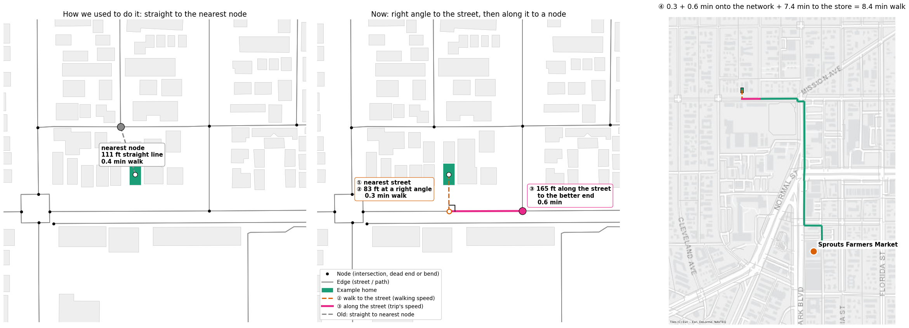
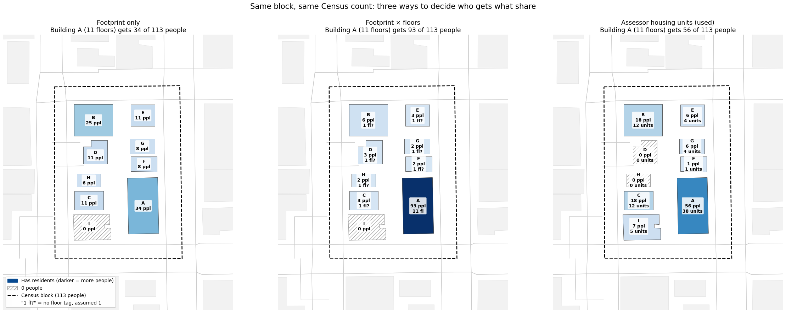
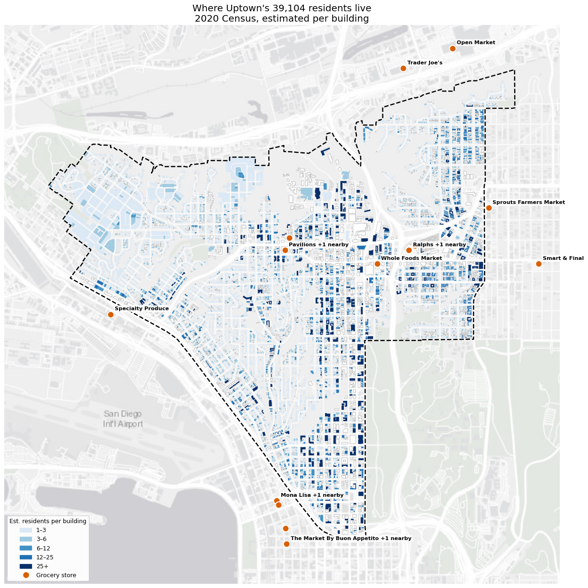
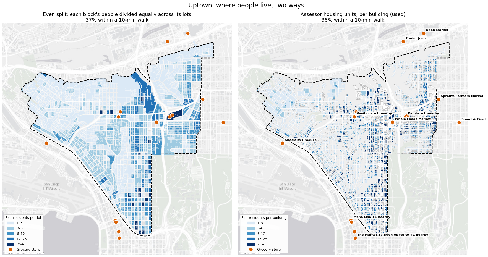

## Datasets

- **City of San Diego Community Plan Areas ([data.sandiego.gov](https://seshat.datasd.org/gis_community_planning_districts/cmty_plan_datasd.geojson))**
  - Neighborhood boundaries
- **[OpenStreetMap](https://www.openstreetmap.org)** and **[OSMnx](https://osmnx.readthedocs.io)**
  - Grocery stores
  - Buildings
- **Census Bureau's [TIGERweb](https://tigerweb.geo.census.gov/arcgis/rest/services/TIGERweb/Tracts_Blocks/MapServer/12)**
  - 2020 Census block population
- **San Diego County Assessor parcels via [SANDAG / SanGIS](https://geo.sandag.org/server/rest/services/Hosted/Parcels/FeatureServer/0)**
  - Housing units per lot
- **San Diego MTS GTFS feed ([sdmts.com](https://www.sdmts.com/google_transit_files/google_transit.zip))**
  - Bus schedule
- **[Esri World Gray Canvas tiles](https://www.arcgis.com/home/item.html?id=291da5eab3a0412593b66d384379f89f)**
  - Basemap

## Assumptions

### Travel
- Walk speed 3mph
- Bike speed 10mph
- Ignored hills
- Times are **home → store** only
- Ignored bus wait times
- No bus transfers counted

### Where people live
- Census population and County Assessor housing unit data are the sources of truth
- Each unit contains the same number of people
- The biggest building on the lot contains the people
- A building belongs to the lot its center falls in
- Commercial lots with 1 unit have no homes, except the assessor's "combination commercial/residential" code and historic homes in the Mills Act program

*For more details, scroll down to "Who lives in which building?"*

## Data Decisions

### How do you get from your door to the street?
- **First attempt:** a straight line to the nearest intersection (node). This works in theory, but it cuts through buildings and yards you might not actually be able to walk through. Also, the nearest node might be in the opposite direction from the grocery store.
- **Current method:** walk to the closest street at a right angle, then go along it in whichever direction gets you to a store sooner.

### Who lives in which building?

The Census counts people per block, not per building. Since the walk/transit/bike zones cut through blocks, the Census population had to be spread out within each block. This analysis used building and unit data to estimate that spread.

Methods explored:

- **Footprint only:** bigger buildings get more people, but an 11-story tower counts the same as a one-story building of the same size.
- **Footprint × floors:** better, but only 1.4% of buildings have a floor count in OpenStreetMap, so the one tower that does can swallow the whole block.
- **Assessor housing units (chosen method):** the County Assessor records how many homes are on each lot. That's the closest thing to "people per building" that's public. A 40-unit apartment building gets 40 times the people of a house on the same block.

The assessor counts homes per lot, not per building, and neither source covers every building. This is the path each block's people take to a building. Dashed boxes are where the data has a gap and something stands in.

<ul class="tree">
<li>
A Census block with people in it<small>42,024 people on the 522 blocks the map touches</small>
<ul>
<li>
Does the County Assessor list any homes on the block?
<ul>
<li>Yes
Split the block's people by housing units<small>41,684 people. Then, for each lot with homes:</small>
<ul>
<li>
Is a building's center on the lot?
<ul>
<li>Yes
The biggest of those buildings gets them <b class="ex">①</b>
</li>
<li>No
Does a building cover at least 20% of the lot?
<ul>
<li>Yes
That building gets them<small>A big building covering several lots</small>
</li>
<li>No
The lot's outline stands in for the building <b class="ex">②</b><small>2,211 people on 741 lots. OpenStreetMap hasn't mapped every house</small>
</li>
</ul>
</li>
</ul>
</li>
</ul>
</li>
<li>No
Does OpenStreetMap show any buildings people live in?<small>14 blocks, 340 people</small>
<ul>
<li>Yes
Split by floor area <b class="ex">③</b><small>235 people. Only 1.4% of buildings have a floor count; the rest count as 1 story</small>
</li>
<li>No
Split across every building on the block<small>105 people</small>
</li>
</ul>
</li>
</ul>
</li>
</ul>
</li>
</ul>

**Commercial lots with 1 unit**

- The assessor gives most shops and offices 1 unit even when nobody lives there, so only 2+ units count there
- Checked against [SANDAG's 2025 land use map](https://geo.sandag.org/server/rest/services/Hosted/Land_Use_2025/FeatureServer/0), which is built from aerial photos: it shows no homes on 95% of the commercial lots listing 1 unit (754 of 797)

The result for all of Uptown: every building colored by its estimated residents. The large pale shapes in the northwest are lot outlines standing in for houses OpenStreetMap hasn't mapped.

Was all this population work worth it? Probably not, but I enjoyed the deep dive. The map below shows what it would look like to just spread each Census block's population evenly across its parcels:

| | Even split across lots | Assessor units, per building (used) |
|---|---:|---:|
| Residents in neighborhood | 39,314 | 39,104 |
| Within 10-min walk | 37.0% | 37.5% |
| Within 5-min bike ride | 68.7% | 69.9% |
| Within 10-min bus + walk | 54.1% | 56.7% |

## The work

All of the analysis is in one Jupyter notebook: pulling the data, estimating residents per building, timing every trip, and the maps.

<!-- TODO: replace YOUR-USERNAME once the public repo exists -->
[See the notebook on GitHub →](https://github.com/YOUR-USERNAME/grocery-access/blob/main/notebooks/grocery_stores_population.ipynb)
